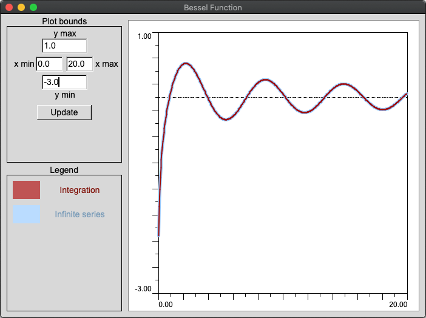

## Introduction

This is the collection of various applications for mechanics simulations and structural engineering models written in Rust. 

## Dependencies

* Install `cargo`
* On RedHat-based systems install `libstdc++-static`

## Contents

### FluidCalc

Calculator for fluid flow functions (**&tau;(&lambda;)**, **&pi;(&lambda;)**, **&epsilon;(&lambda;)**, **q(&lambda;)**, **&phi;(&lambda;)** and **y(&lambda;)**) and reverse calculator for finding lambda parameter based on function value (**&lambda;(&tau;)**, **&lambda;(&pi;)**, **&lambda;(&epsilon;)**, **&lambda;(q)**, **&lambda;(&phi;)** and **&lambda;(y)**).

&nbsp;

### FluidView

Graphical solver for fluid flow **&lambda;1(q)** and **&lambda;2(q)** functions that uses [Newton's method](https://en.wikipedia.org/wiki/Newton%27s_method).

### BesselGraph

Graph plot of Bessel functions of the first kind of 0-th order **Y0(x)** calculated with two methods: using integration and infinite series.

* [Bessel functions of the second kind: Y&alpha;](https://en.wikipedia.org/wiki/Bessel_function#Bessel_functions_of_the_second_kind)

### MechanicalPendulum

Simple model of a mechanical pendulum.

### WaveView

Graphical demonstration of fluid mechanics problem of a fluid in
rectangular channel of infinite length.

### MediaWave

Graphical demonstration of fluid mechanics problem of haze in a tube
of limited length with various initial boundary conditions for the tube
edges (e.g. closed, opened, with friction) as well as for pressure and velocity
of a fluid.

## Links

* Original utils written in C++ &ndash; https://github.com/Postrediori/MechanicsPrograms
